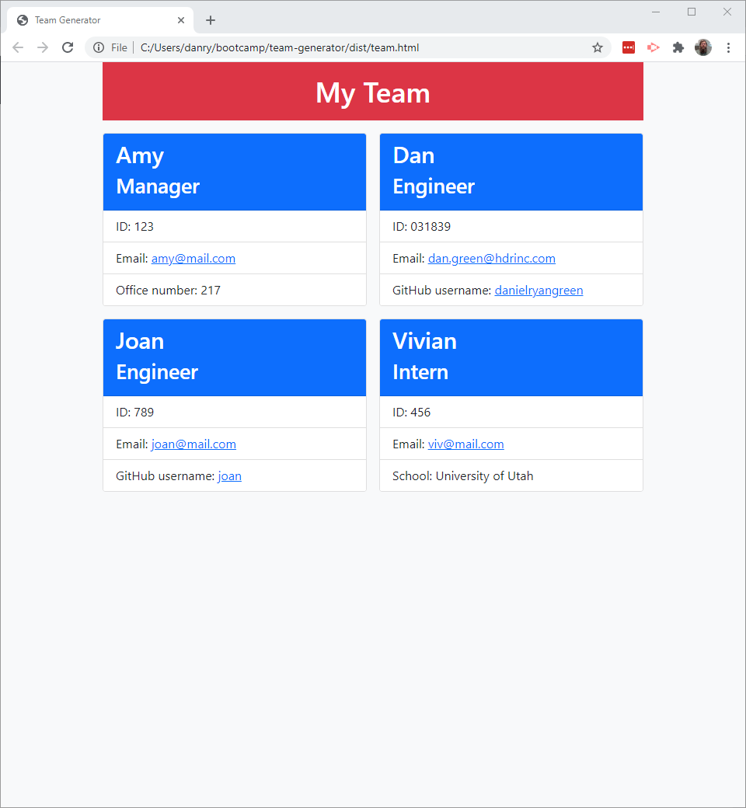

# Team Generator
  
  ## Description
  Command-line application to create a team webpage from user input.
  ## Table of Contents
  * [Installation](#installation)
  * [Usage](#usage)
  * [License](#license)
  * [Contributing](#contributing)
  * [Tests](#tests)
  * [Questions](#questions)
  ## Installation
  To install required packages, enter `npm i` in the terminal.
  ## Usage
  To run the application, enter `node index.js` in the terminal.

  Here is a walkthrough video that demonstrates the functionality of the application.

  [Google Drive](https://drive.google.com/file/d/1JYnEdhZ_4Uij9Ta3MODossJgsqY3LbSB/view?usp=sharing)
  
  Here is a sample webpage that was generated using the application.
  
  
  ## License
  This project is covered under the MIT license.
  ## Contributing
  Please submit a pull request.
  ## Tests
  To run tests, enter `npm run test` in the terminal.
  ## Questions
  Please contact me at dan.ryan.green@gmail.com if you have any questions. See my other work at [danielryangreen](https://github.com/danielryangreen/) on GitHub.
  